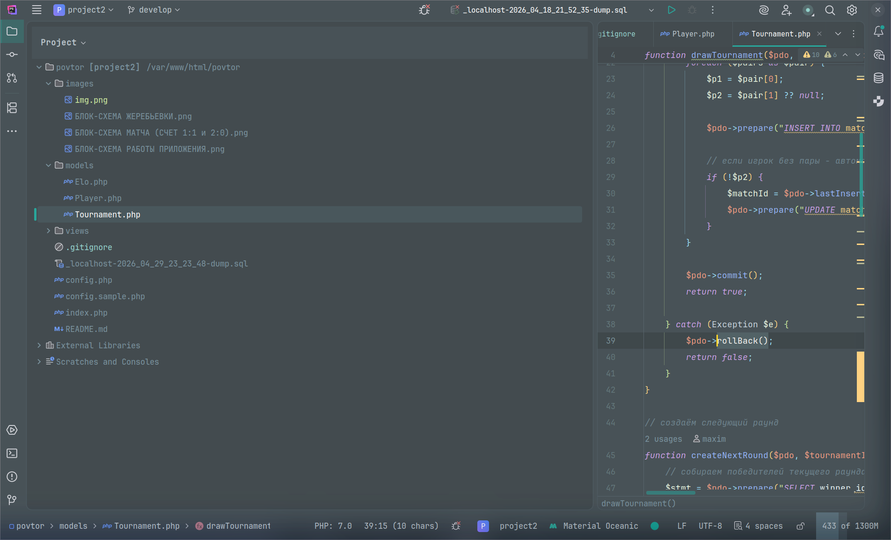

# Chess Tournament Manager

> Веб-приложение для проведения шахматных турниров по олимпийской системе

**Демо:** [tournamentmaxtm.42web.io](http://tournamentmaxtm.42web.io/index.php?action=players)

---

## 📸 Блок-схемы (ТЗ)

| Название | Схема |
|----------|-------|
| Блок-схема работы приложения |  |
| Блок-схема жеребьевки |  |
| Блок-схема матча (счет 1:1 и 2:0) | .png) |


## Что делает проект

Автоматизирует проведение шахматных турниров «на вылет» (Single Elimination):

- Добавление и удаление игроков
- Случайная жеребьевка с поддержкой нечётного количества (bye)
- Турнирная сетка в реальном времени
- Матчи до 2 побед (Best of 3) с отображением счета
- AJAX-обновление без перезагрузки страницы
- Подсчет побед/поражений
- Система рейтинга Эло
- Определение чемпиона с торжественным поздравлением


## Технологии

| Компонент | Технология |
|-----------|------------|
| Backend | PHP 8.3 |
| Database | MariaDB / MySQL (PDO) |
| Frontend | HTML5, CSS3 |
| AJAX | JavaScript (Fetch API) |
| Архитектура | Front Controller (MVC-подобная) |
| Сервер | Apache / Nginx / OpenServer |


## Структура проекта

| Стурктура проекта |  |


## Установка и запуск

### 1. Клонировать репозиторий
```bash
git clone https://github.com/limoore21/ChessTournament.git
cd ChessTournament

2. Настроить базу данных

Выполните SQL-запрос из раздела SQL-запрос в phpMyAdmin или через консоль.
3. Настроить подключение

Скопируйте config.sample.php в config.php и укажите свои данные:
php

$host = 'localhost';
$db   = 'chess_tournament';
$user = 'root';
$pass = '';

4. Запустить

    OpenServer: Поместите папку в domains/

    Apache: Настройте виртуальный хост

    PHP Built-in server: php -S localhost:8080

 Как пользоваться
Шаг	Действие
1	Перейдите в раздел УЧАСТНИКИ
2	Добавьте минимум 2 игрока (лучше 4-8)
3	Нажмите АДМИН → введите пароль 1234
4	Нажмите ЖЕРЕБЬЕВКА — создастся турнирная сетка
5	В разделе СЕТКА нажимайте WIN у победителя
6	Матч идёт до 2 побед (счет 1:0 → 1:1 → 2:1)
7	Система сама создаёт следующий раунд
8	В финале появится чемпион


 Админ-доступ

    Нажмите АДМИН в меню

    Пароль: 1234

    После входа появляются кнопки: ЖЕРЕБЬЕВКА, WIN, СБРОСИТЬ ИГРОКОВ, ВЫХОД


 Система рейтинга Эло

    Начальный рейтинг: 1200

    K-фактор: 32

    Формула: R' = R + K * (S - E)

После каждого матча рейтинг пересчитывается автоматически:

    Победа над равным → +16 очков

    Победа над слабым → +8 очков

    Поражение от слабого → -24 очка

Рейтинг отображается в таблице игроков с цветовой индикацией:

     2000+ — золото

     1600-1999 — серебро

     1200-1599 — бронза

     до 1199 — дерево

 SQL-запрос
sql

CREATE DATABASE IF NOT EXISTS chess_tournament;
USE chess_tournament;

SET FOREIGN_KEY_CHECKS = 0;

-- Таблица игроков
DROP TABLE IF EXISTS players;
CREATE TABLE players (
    id INT(11) NOT NULL AUTO_INCREMENT,
    nickname VARCHAR(100) NOT NULL,
    wins INT DEFAULT 0,
    losses INT DEFAULT 0,
    elo_rating INT DEFAULT 1200,
    elo_history TEXT,
    PRIMARY KEY (id)
) ENGINE=InnoDB DEFAULT CHARSET=utf8mb4;

-- Таблица турниров
DROP TABLE IF EXISTS tournaments;
CREATE TABLE tournaments (
    id INT(11) NOT NULL AUTO_INCREMENT,
    title VARCHAR(255) NOT NULL,
    PRIMARY KEY (id)
) ENGINE=InnoDB DEFAULT CHARSET=utf8mb4;

-- Таблица раундов
DROP TABLE IF EXISTS rounds;
CREATE TABLE rounds (
    id INT(11) NOT NULL AUTO_INCREMENT,
    tournament_id INT(11) NOT NULL,
    round_number INT(11) NOT NULL,
    round_name VARCHAR(100) DEFAULT NULL,
    PRIMARY KEY (id),
    CONSTRAINT fk_round_tournament FOREIGN KEY (tournament_id) REFERENCES tournaments(id) ON DELETE CASCADE
) ENGINE=InnoDB DEFAULT CHARSET=utf8mb4;

-- Таблица матчей
DROP TABLE IF EXISTS matches;
CREATE TABLE matches (
    id INT(11) NOT NULL AUTO_INCREMENT,
    round_id INT(11) NOT NULL,
    player1_id INT(11) DEFAULT NULL,
    player2_id INT(11) DEFAULT NULL,
    winner_id INT(11) DEFAULT NULL,
    player1_score INT DEFAULT 0,
    player2_score INT DEFAULT 0,
    is_completed TINYINT DEFAULT 0,
    PRIMARY KEY (id),
    CONSTRAINT fk_match_round FOREIGN KEY (round_id) REFERENCES rounds(id) ON DELETE CASCADE,
    CONSTRAINT fk_player1 FOREIGN KEY (player1_id) REFERENCES players(id) ON DELETE SET NULL,
    CONSTRAINT fk_player2 FOREIGN KEY (player2_id) REFERENCES players(id) ON DELETE SET NULL,
    CONSTRAINT fk_winner FOREIGN KEY (winner_id) REFERENCES players(id) ON DELETE SET NULL
) ENGINE=InnoDB DEFAULT CHARSET=utf8mb4;

-- Таблица участников турнира (связующая)
DROP TABLE IF EXISTS tournament_participants;
CREATE TABLE tournament_participants (
    tournament_id INT(11) NOT NULL,
    player_id INT(11) NOT NULL,
    PRIMARY KEY (tournament_id, player_id),
    CONSTRAINT fk_tp_tournament FOREIGN KEY (tournament_id) REFERENCES tournaments(id) ON DELETE CASCADE,
    CONSTRAINT fk_tp_player FOREIGN KEY (player_id) REFERENCES players(id) ON DELETE CASCADE
) ENGINE=InnoDB DEFAULT CHARSET=utf8mb4;

SET FOREIGN_KEY_CHECKS = 1;

-- Стартовый турнир
INSERT INTO tournaments (id, title) VALUES (1, 'Главный турнир');

 В планах на будущее

    ~~Счетчик Эло~~

    ~~AJAX-обновление без перезагрузки~~

    ~~Матчи до 2 побед (Best of 3)~~

    Добавление истории завершенных турниров

    Возможность редактирования никнеймов игроков

    Генерация PDF-отчета с результатами турнира

    Оптимизация сетки под другие виды спорта

    Круговая система турнира

    Экспорт в Excel

 Разработчик

Максимко
GitHub: @limoore21
